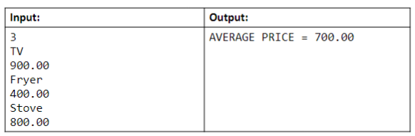

# Produtos em vetor

Fazer um programa para ler um número inteiro N e os dado o (nome e preço) de N Produtos. Armazene os N produtos em um vetor. Em seguida, mostrar o preço médio dos produtos.

## Exemplo

