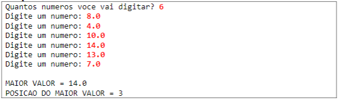

# Maior posição 

Faça um programa que leia N números reais e armazene-os em um vetor. Em seguida, mostrar na tela o maior número do vetor (supor não haver empates). Mostrar também a posição do maior elemento, considerando a primeira posição como o (zero).

## Exemplo

