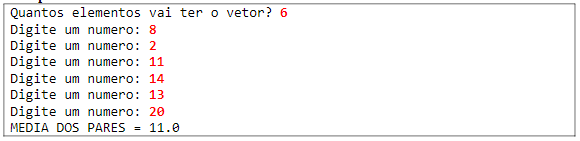
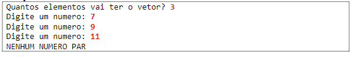

# Média pares

Fazer um programa para ler um vetor de N números inteiros. Em seguida, mostrar na tela a média aritmética somente dos números pares lidos, com uma casa decimal. Se nenhum número par for digitado, mostrar a mensagem "NENHUM NUMERO PAR"

## Exemplo 1

## Exemplo 2

