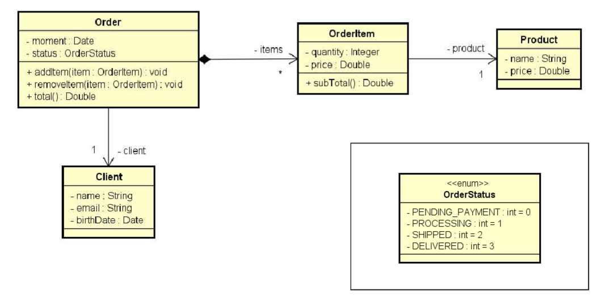
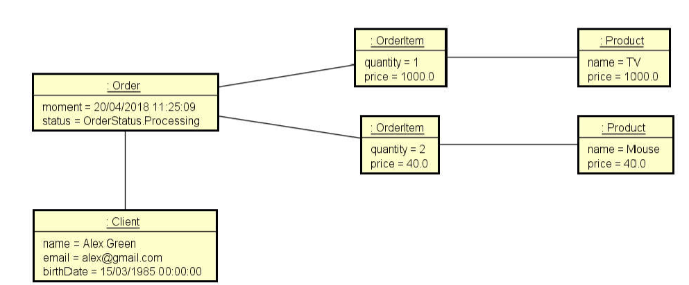
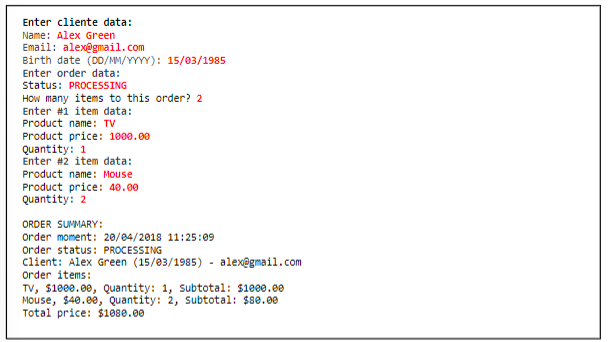

# Pedido

Ler os dados de um pedido com N itens (N forneceido pelo usuário). Depois, mostrar um sumário do pedido conforme 
exemplo. 

**Nota**: o instante do pedido deve ser o instante do sistema: new Date().

## Diagrama de classes

## Diagrama de objetos

## Console output

