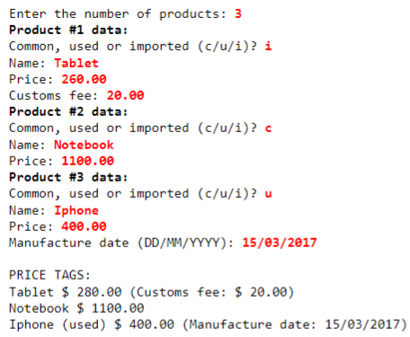

# Gerenciar produto

Fazer um programa para ler os dados de N produtos (N fornecido pelo usuário). Ao final, mostrar a etiqueta de preço 
de cada produto na mesma ordem em que foram digitados. Todo produto possui nome e preço. Produtos importados possuem 
uma taxa de alfândega, e produtos usados possuem data de fabricação. Estes dados específicos devem ser acrescentados 
na etiqueta de preço conforme [Exemplo](#Exemplo). Para produtos importados, a taxa de alfândega deve ser 
acrescentada ao preço final do produto. 

> [!WARNING]
> 
> Favor Implementar o programa conforme projeto da [Figura 1](#figura-1)

## Figura 1 {#figura-1}

## Exemplo {#Exemplo}

